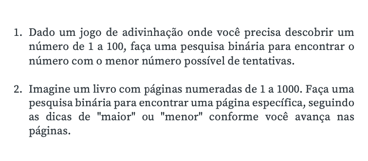
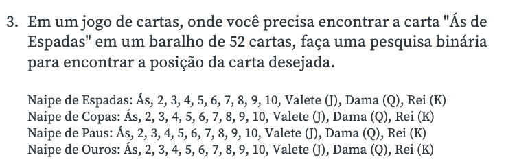
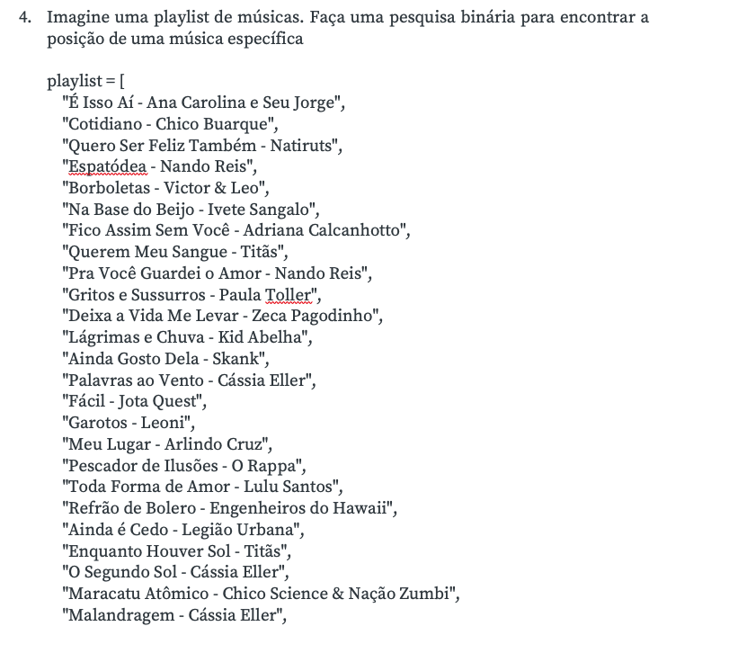

<h1 align="center"> Universidade de Vassouras</h1>

<h4>Curso: Engenharia de Software 
Disciplina: Estrutura de dados 
Professor: Márcio Garrido 
Período: 3° Período</h4>
 
 
<h2 align="center"> Exercícios de pesquisa binária</h2>
 

